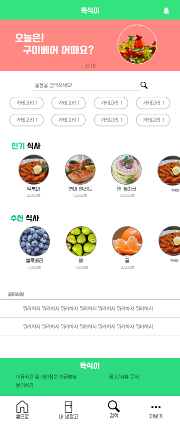
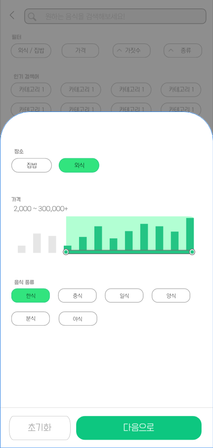
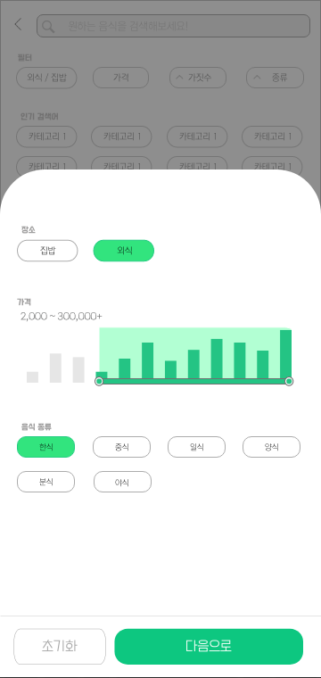
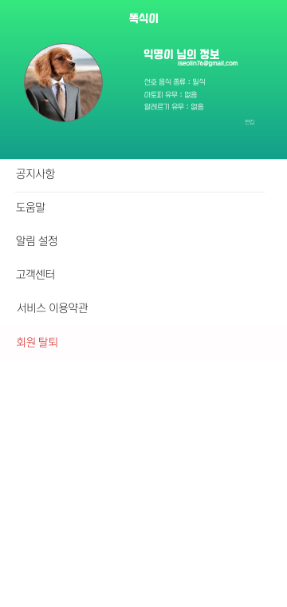

# 기능 명세서

## 목차

- 사용자

- [기능 명세서](#기능-명세서)

  - [목차](#목차)
  - [계정 관리](#계정-관리)
  - [메인 페이지](#메인-페이지)
  - [내 냉장고](#내-냉장고)
  - [검색](#검색)
  - [더보기](#더보기)
  - [논의해야 할 사항](#논의해야-할-사항)

- 관리자

## 계정 관리

| 기능 명        | 세부 기능         | 설명                                                                | 비고                                                               |
| -------------- | ----------------- | ------------------------------------------------------------------- | ------------------------------------------------------------------ |
| 회원가입       | 정보 입력         | 아이디, 선호 식단, 아토피/알레르기 여부, 이름(닉네임), 프로필 사진  |                                                                    |
|                | 외부 API 회원가입 | naver, google, kakao API 로 로그인 후 토큰 받아오기                 | 자체 회원 가입은 없음                                              |
|                | 건너뛰기          | "그냥 넘어갈래요" 버튼을 통해 게스트 사용자로 활동                  | "로그인을 하지 않으면 일부 기능을 사용할 수 없습니다." 띄우기      |
|                | 기존 계정 확인    | 기존에 있는 계정인 지 판별                                          | 기존에 있는 계정일 시 "이미 있는 계정입니다." 띄우기               |
|                | 계정 정보 생성    | 새로운 사용자의 빈 내 냉장고, 빈 최근 식단 생성 및 계정 정보를 저장 |                                                                    |
|                | 초기 정보 입력    | 1. 선호하는 음식 종류를 입력                                        | 사용자 정보 / 추후 수정 가능                                       |
|                |                   | 2. 아토피/알레르기 여부를 입력                                      | 사용자 정보 / 추후 수정 가능                                       |
|                |                   | 3. 이름 입력                                                        | 사용자 정보 / 추후 수정 가능                                       |
| 로그인         | 로그인            | 외부 API로 로그인 후 있는 계정인 지 확인                            | 계정을 저장하여 앱을 나가도 로그인 상태로 유지한다.                |
|                | 로그인 유지       | 한 달동안 로그인 상태로 유지한다.                                   |                                                                    |
|                | 로그인 실패       | "없는 계정입니다."를 띄운다                                         | 회원가입하시겠습니까? 버튼, 비밀번호를 잊어버리셨나요? 버튼을 생성 |
|                | 로그인 성공       | "로그인 되었습니다."를 띄우고 메인 페이지로 이동한다                |                                                                    |
|                | 로그인한 계정     | 로그인한 계정 이메일을 띄움                                         | 게스트 상태일 시 게스트라고 띄움                                   |
| 계정 관리      | 로그인 O          | 로그아웃, 회원 정보 수정 및 회원 탈퇴 버튼                          |                                                                    |
|                | 로그아웃          | 로그아웃                                                            | 계정 저장을 해지                                                   |
|                | 로그인 X          | 로그인 버튼, "게스트 회원입니다" 띄우기                             |
|                | 회원 탈퇴         | "정말 탈퇴하시겠습니까? 정보는 복구되지 않습니다." 띄우기           | 회원 정보 삭제 / 게스트일 시 뜨지 않음                             |
| 회원 정보 수정 | 프로필 편집       | 프로필 사진, 이름, 입맛정보 편집                                    |                                                                    |
|                | 입맛정보 편집     | 선호 음식 종류, 아토피/알레르기 유무 수정                           | 어떤 음식에 반응하는 지 기술                                       |

## 메인 페이지

| 기능명        | 세부 기능                  | 설명                                                                                                 | 비고                       |
| ------------- | -------------------------- | ---------------------------------------------------------------------------------------------------- | -------------------------- | ---- |
| 헤더          | 로고                       | 메인 페이지로 이동                                                                                   |                            |
|               | 종 모양 아이콘             | 알림 내역으로 이동                                                                                   |                            |
| 상단 슬라이드 | 광고 및 추천 정보          | 스와이프로 이동 및 3초마다 자동 스와이프                                                             |                            |
| 빠른 검색     | 검색 바                    | 키워드를 입력 받고 엔터 및 돋보기 버튼을 누르면 검색                                                 | 입력이 없을 시 검색 실행 X |
|               | 카테고리                   | 인기 순으로 나열/누르면 해당 카테고리로 검색                                                         | 세부 사항이 정해지지 않음  | 검색 |
| 추천 박스     | 인기 식사                  | 인기 순으로 10개 나열, 스와이프로 이동                                                               |                            |
|               | 추천 식사                  | 사용자가 즐겨 찾는 키워드 및 알레르기, 아토피에 해당 사항이 없는 항목으로 10개 나열, 스와이프로 이동 |
| 공지사항      | 앱 내 공지를 최신 2개 띄움 |                                                                                                      |
| 푸터          | 로고                       | 홈으로 이동                                                                                          |                            |
|               | 이용약관 및 ...            | 이용약관 및 ... 을 명시한 페이지로 이동                                                              | 아직 세부사항이 없음       |
|               | 문의 하기                  | 문의 창으로 이동                                                                                     | 아직 세부사항이 없음       |
|               | 광고/제휴 문의             | 광고/제휴 문의 창으로 이동                                                                           | 아직 세부사항이 없음       |
| 내비게이션 바 | 홈으로                     | 메인페이지로 이동                                                                                    |                            |
|               | 내 냉장고                  | 내 냉장고로 이동                                                                                     |                            |
|               | 더보기                     | 더보기로 이동                                                                                        |                            |

## 내 냉장고

| 기능 명      | 세부 기능        | 설명                                                                         | 비고                                                               |
| ----------- | ---------------- | ---------------------------------------------------------------------------- | ------------------------------------------------------------------ |
| 헤더        | 로고             | 메인페이지로 이동                                                            |                                                                    |
| 유저 정보   | 유저 닉네임      | 유저 닉네임을 띄움 "익명이" 님의 ...                                         |                                                                    |
| 검색 바     | 키워드 검색      | 내 냉장고 내 해당 키워드에 맞는 음식을 검색                                  |                                                                    |
| 카테고리    | 카테고리 검색    | 해당 카테고리에 맞는 음식을 검색                                             | 구체적인 정보가 있지 않음                                          |
|             |                  | 육류, 야채류, 유제품, 생선류, 기타 5가지 카테고리가 있음                     | |
| 식재료 박스 | 식재료 추가 버튼 | 내 냉장고 추가 창으로 이동                                                   |                                                                    |
|             | 내 냉장고 목록   | 내 냉장고 내의 30개의 목록을 가나다 순으로 나열                              | 30개의 정보를 먼저 받아오고 스크롤로 내리며 다 보았을 때 다시 요청 |
| 식재료      | X 버튼           | 식재료 삭제, "삭제하시겠습니까?" 모달 띄우기                                 |                                                                    |
|             | 식재료 보기      | 이름, 개수, 등록 일자, 사진                                                  |                                                                    |
|             | > 버튼           | 물품 정보 창으로 이동                                                        | 식재료 칸을 눌러도 이동                                            |
| 식재료 추가 | 텍스트 추가      | 검색 바로 키워드 검색 후 물품 수량 입력                                      | 사진 추가로 가는 버튼도 있음/키워드와 유사한 순으로 나열           |
|             | 사진 추가        | 카메라를 키고 사물에 초점을 맞추면 ai 이미지 인식 후 유사한 순으로 품목 나열 | 세부 정보 정해지지 않음                                            |
| 물품 정보   | 물품 박스        | 이름, 효능, 평균 가격, 사진                                                  |                                                                    |
|             | 성분 박스        | 성분 구성 선 그래프, 특이 성분 미리 보기, 특이 사항(다이어트, 건강)          | 특이 성분이 뭘까 / 세부 정보 정해지지 않음                         |
|             | 활용 레시피      | 해당 식재료로 만들 수 있는 레시피를 10개 나열                                | 유튜브에서 퍼온다                                                  |
|             | 레시피 추천 영상 | 유튜브 영상 생각 중                                                          | 세부 정보 정해지지 않음                                            |

## 검색

| 기능명              | 세부 기능        | 설명                                                                            | 비고                                                             |
| ------------------- | ---------------- | ------------------------------------------------------------------------------- | ---------------------------------------------------------------- |
| 검색                | 키워드 검색      | 검색 바로 키워드를 입력 후 엔터를 누르면 검색 / 키워드가 입력이 안됐을 시 검색X |                                                                  |
| 추천 카테고리       | 추천 카테고리    | 인기 순으로 나열/누르면 해당 카테고리로 검색                                    | 세부 사항 없음                                                   |
| 검색 필터           | 장소             | 집밥 또는 외식 중 택 1                                                          |                                                                  |
|                     | 가격             | 가격 그래프 바로 범위 조절                                                      | 최소 값 미정, 최대 가격 초과 시 옆에 + 표시                      |
|                     | 음식 종류        | 한식 중식 일식 양식 분식 야식 중 택                                             | 다중 선택 가능                                                   |
| 의사 결정 버튼      | 초기화           | 선택한 필터를 초기화 시킨다                                                     |                                                                  |
|                     | 다음으로         | 선택한 필터를 적용해 검색한다                                                   | 텍스트 입력이 안 되었을 시 필터 적용 한 채로 검색 바에 자동 커서 |
| 검색 결과           | 다시 검색        | 검색 바로 다시 키워드 검색                                                      |                                                                  |
|                     | 필터             | 필터 재설정 또는 설정                                                           |                                                                  |
|                     | 검색 결과 식품   | 가나다 순 정렬, 가격 순 정렬                                                    | 정렬 방법 추가 고려                                              |
|                     |                  | 검색 결과가 없을 시 "검색 결과가 존재하지 않아요!" 띄우기                       |                                                                  |
| 검색 물품 세부 정보 | 헤더             | 뒤로 가기 버튼, 오류 신고 버튼                                                  | 오류 신고 버튼은 오류 신고 창으로 이동                           |
|                     | 물품 정보 박스   | 사진, 이름                                                                      |                                                                  |
|                     | 물품 성분 박스   | 성분 구성 막대기 그래프, 주의 사항, 자세히 보기, 특이 사항(다이어트, 건강)      | 자세히 보기에 무엇이 뜰 지 정해지지 않음                         |
|                     | 유사 건강 음식   | 유사 건강 음식 10가지 나열                                                      | 기준이 정해지지 않음                                             |
|                     | 유사 인기 음식   | 유사 인기 음식 10가지 나열                                                      | 인기 순 정렬                                                     |
|                     | 유사 음식 레시피 | 유튜브 동영상 예상                                                              | 걸작 떡볶이라면 떡볶이 조리법                                    |

## 더보기

| 기능명          | 세부 기능               | 설명                                                                                  | 비고                                                            |
| --------------- | ----------------------- | ------------------------------------------------------------------------------------- | --------------------------------------------------------------- |
| 사용자 정보     | 프로필 사진             | 사용자의 프로필 사진을 등록합니다.                                                    | 게스트일 경우 게스트 표시, 없을 경우 프로필 사진 추가 문구가 뜸 |
|                 | ~님의 정보              | 사용자의 이름 + 님의 정보 라고 띄움                                                   |
|                 | 선호 음식               | 사용자가 지정한 선호 음식 종류 표시                                                   | 다중 표시 가능                                                  |
|                 | 아토피, 알레르기 유뮤   | 아토피, 알레르기 유무 표시                                                            | 있다면 세부 사항 표시 ex) 땅콩 알레르기                         |
|                 | 편집                    | 사용자 정보를 편집하는 창으로 넘어갑니다.                                             |                                                                 |
| 공지사항        | 공지사항 표시           | 최신순으로 최대 20개                                                                  |                                                                 |
| 도움말          | 도움말                  | 앱을 어떻게 사용하는 지 안내                                                          | 세부사항 필요                                                   |
| 알림 설정       | 앱 내 알림을 설정한다.  | 알림 설정 창으로 넘어갑니다.                                                          |                                                                 |
| 고객센터        | 고객 민원을 접수합니다. | 고객 민원 창으로 넘어갑니다.                                                          | 세부사항 필요                                                   |
| 서비스 이용약관 | 서비스 이용약관         | 세부사항이 없음                                                                       | 세부사항이 없음                                                 |
| 회원 탈퇴       | 회원을 탈퇴합니다.      | '정말로 탈퇴하시겠습니까? 정보는 복구되지 않습니다' 모달을 띄우고 확인을 누를 시 탈퇴 | 유저 정보를 삭제한다.                                           |

## 논의해야 할 사항

- [ ] 검색 카테고리
- [ ] 냉장고 카테고리
- [ ] 광고/제휴 문의
- [ ] 문의하기
- [ ] 이용약관 및 개인정보 취급방침
- [ ] ai 이미지 인식 할 수 있어?
- [ ] 특이 성분이 뭘까 (물품 정보)
- [ ] 유튜브 영상 끌어올 수 있어?
- [ ] 검색 가격 최솟값
- [ ] 검색 결과 물품 정렬 방법
- [ ] 오류 신고 창
- [ ] 자세히 보기에 무엇이 뜰 지
- [ ] 유사 음식 기준
- [ ] 도움말
- [ ] 고객 민원
- [ ] 서비스 이용약관(설정)
